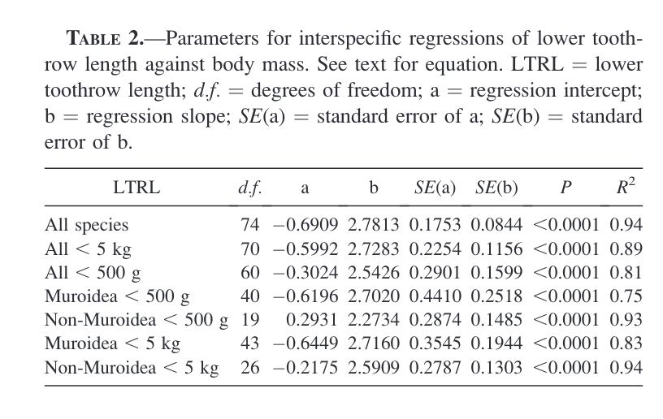
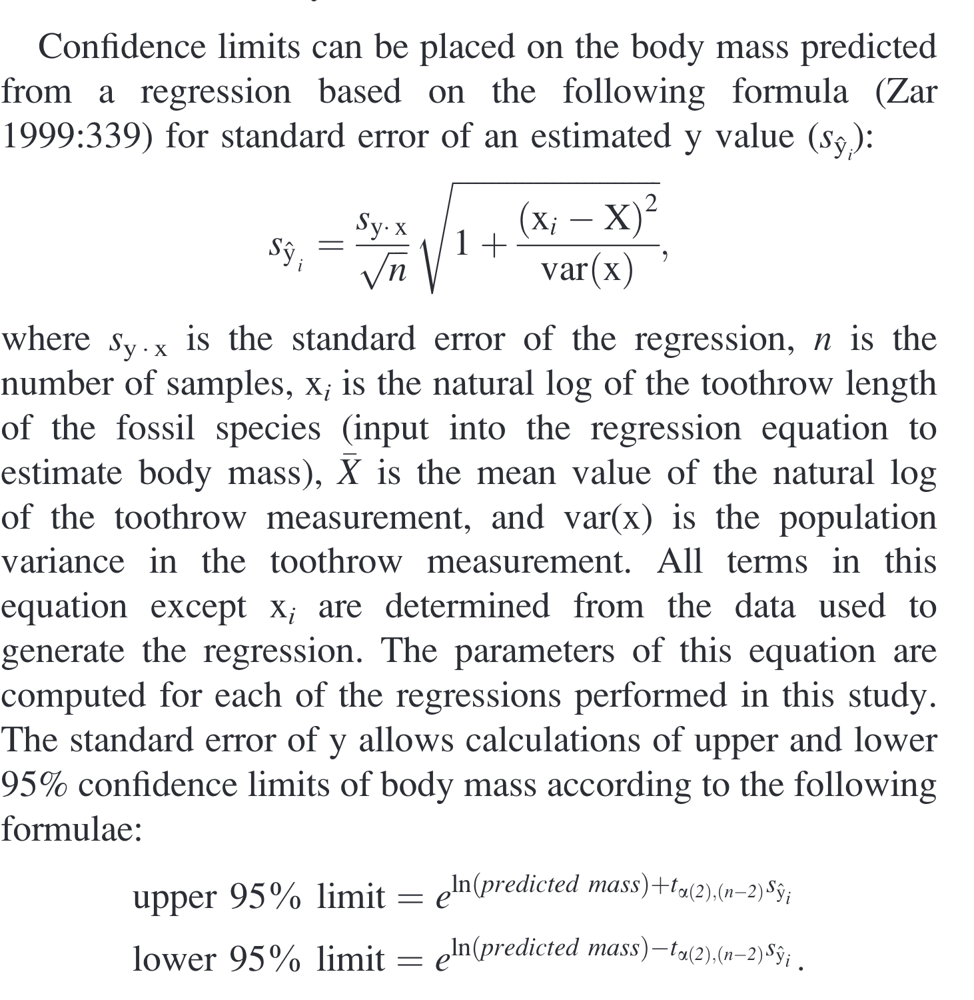
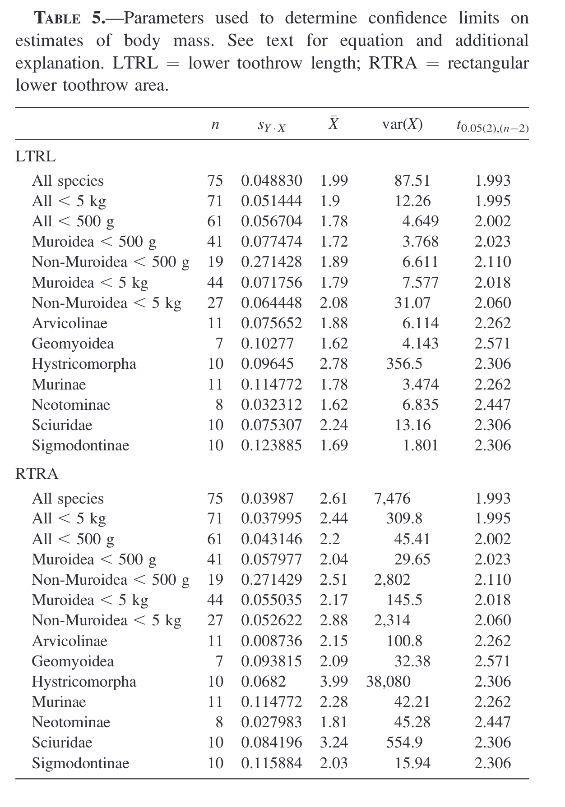
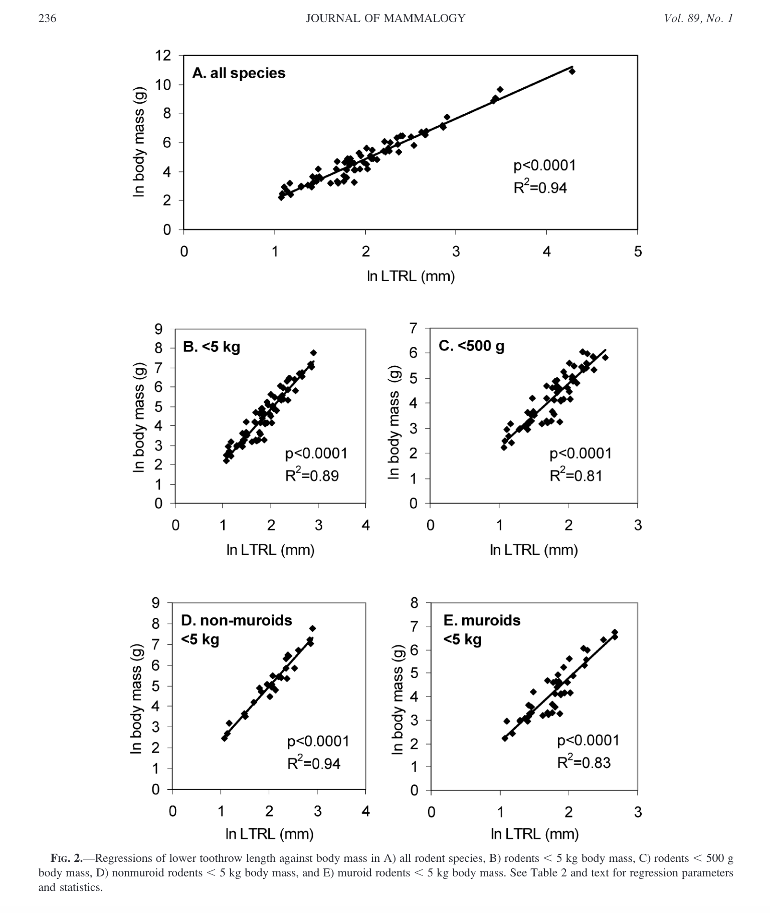
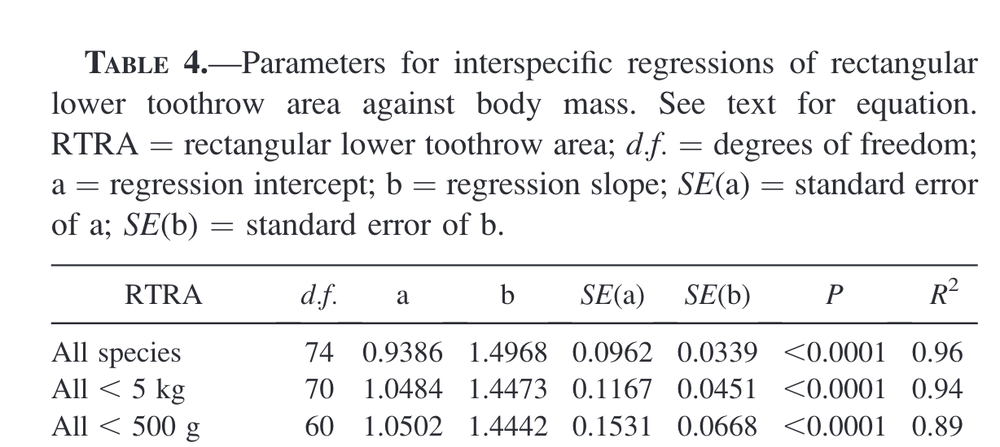

# Data Analysis Replication Assignment

## Information About the Publication 
### Hopkins 2008: REASSESSING THE MASS OF EXCEPTIONALLY LARGE RODENTS USING TOOTHROW LENGTH AND AREA AS PROXIES FOR BODY MASS

A common tool used by paleontologists to understand the physiology, ecology and evolution of fossil mammals (and also fossil vertebrates) is reconstructing body size. In mammals in particular, this can be done using dimensions of the appendicular skeletal elements and dental morphology. For rodents in particular this most commonly is seen using the first lower molar (m1), but in this paper a proxy for body mass is developed using toothrow length and area for the dentary (lower jaw). 

The main objective of this publication was to estimate body mass for extinct rodent taxa from dental toothrow length and area and determine the effectiveness of these proxies compared with previously published estimations of body mass from femur diameter. 

This study showed that tooth dimensions are accurate for estimating body mass when looking at interspecific comparisons, and even omre accurate proxies when looking at narrow subclades within Rodentia that are more closely related to a fossil taxa of interest. 

In the following code I will replicate the regression analyses for establishing both lower toothrow length and rectangular toothrow area as proxies for estimating body mass. The fossil taxa utilized in this study did not have dental measurements provided so could not be included in this replication assignment, but summary statistics and visualizations of the proxy data can be found below.  

```{r setup, include=FALSE} 
knitr::opts_chunk$set(warning = FALSE, message = FALSE) #hiding warning messages for whole document when knitted
```

Libraries Used
```{r, warning=FALSE}
library(tidyverse)
library(dplyr)
library(tidyr)
library(cowplot)
library(broom)

library(sjPlot)
library(sjmisc)
library(sjlabelled)
library(sjstats)

library(jtools)
```


Loading in Dataset
```{r}
rodents <- "https://raw.githubusercontent.com/allyboville3/Data-Replication-Assignment/main/Hopkins%202008%20-%20Appendix1.csv"

rodent_df <- read_csv(rodents, col_names = TRUE)

head(rodent_df)
```

# Cleaning Up the Data for All Species Analysis

## Create columns for Rectangular Toothrow Area (RTRA)
RTRA  = (LTRL X M1 width)

With the acknowledgement that we are making the assumption that rodent cheek teeth are essentially rectangular in shape (and that this may result in an overestimation of body mass), area was calculated by multiplying the length of the toothrow by the width of the first lower molar. The first is most often the largest while the first and second molar are the widest. M1 width in this data refers to either the first or second molar width which can be assumed to be the same and representative of the maximum width of the toothrow. 

```{r}
rodent_with_RTRA <- rodent_df %>% 
  mutate(RTRA = (`LTRL (mm)` * `M1 width (mm)`))

rodent_with_RTRA
```

## Averaging Values and Cleaning Up Spreadsheet for Interspecises Comparisons
```{r}
rodent_avg <- rodent_with_RTRA %>% 
  mutate(Mass = as.numeric(`mass (g)`), Pub_avg_mass = as.numeric(`pub. avg. mass (g)`), RTRA = as.numeric(`RTRA`)) %>% #change data for Mass, Published Average Mass, and Retangular Toothrow Area from type chr to dbl
  group_by(Species) %>% #grouping data by Species
  tidyr::fill(Pub_avg_mass, .direction ="down") %>% #filling in NA's in published averaged masses to make the following code happy
  #"The average body mass reported by Ernest (2003) was used for 3 species (Hydrochoerus hydrochaeris, Graphiurus murinus, and Cryptomys hottentotus) for which museum specimens lacked data on body mass." - Copied from Hopkins 2008
  mutate(Mass = coalesce(Mass,Pub_avg_mass)) %>% #Sub NA values for Mass with Previously published mass averages
  summarize(
    Mass = mean(`Mass`), #averages mass for each species
    LTRL = mean(`LTRL (mm)`), #averages toothrow length for each species
    `Toothrow_Width` = mean(`M1 width (mm)`), #averages toothrow width (based off of M1 width) for each species
    RTRA = mean(RTRA)
    ) %>% 
  mutate(across(where(is.numeric), ~ round(., 2))) # rounding data to only have two decimal places

rodent_avg

```
# ~~~~~~~~~~~~~~~~~~~~~~~~~~~~
# Regression Models
# ~~~~~~~~~~~~~~~~~~~~~~~~~~~~

# 1. All Species
## Running Regression Model for All Species
```{r}
interspecies_lm <- lm(log(Mass) ~ log(LTRL), data = rodent_avg) #linear regression model 


s <- summary(interspecies_lm)
tidy(s, conf.int = TRUE) #TEST to take a look at confidence intervals

tidy(interspecies_lm) #tables showing summary statistsics for this lm
glance(interspecies_lm)

```

## Plotting Mass as a function of Lower toothrow length and Linear Model 
```{r}
p_All <- ggplot(data = rodent_avg, aes(x = log(LTRL), y = log(Mass))) + 
  geom_point() + 
  geom_smooth(method = "lm", formula = y ~ x) +
  xlim(0,5) + #matching dimensions of plot to figure from publication
  ylim(0,12) +
  theme_classic(base_size = 16)

p_All
```

# 2. Species Less than 5kg
Essentially is removing the four largest rodent species. This was done because for large rodents there may be different factors influencing dentition shape and size compared to smaller rodents. Including these larger taxa may result in the regression being misleading. 
```{r}
#removing four largest rodent species from data
rodent_no_outlier <- rodent_avg %>% 
  filter(!Species == "Erithizon dorsatum", !Species == "Castor canadensis", !Species == "Hydrochoeris hydrochoeris", !Species == "Cuniculus paca")

rodent_no_outlier
```
## Running regression for Species separated by mass < 5kg
```{r}
interspecies_small5kg_lm <- lm(log(Mass) ~ log(LTRL), data = rodent_no_outlier)

tidy(interspecies_small5kg_lm)
glance(interspecies_small5kg_lm)
```

## Plotting Mass as a funtion of LTRL for rodents with mass < 5kg
```{r}
p_no_outlier <- ggplot(data = rodent_no_outlier, aes(x = log(LTRL), y = log(Mass))) + 
  geom_point() + 
  geom_smooth(method = "lm", formula = y ~ x) +
  xlim(0,4) +
  ylim(0,9) +
  theme_classic(base_size = 16)

p_no_outlier
```

# 3. Species less than 500g
Filtering data to only all species with mass <500g
```{r}
rodent_smol <- rodent_avg %>% 
  filter(Mass < 500)

rodent_smol 
```
## Running regression for Species separated by mass < 500g

```{r}
interspecies_smol_lm <- lm(log(Mass) ~ log(LTRL), data = rodent_smol)

tidy(interspecies_smol_lm)
glance(interspecies_smol_lm)
```
## Plotting mass as a function of LTRL for species with a mass < 500g 
```{r}
p_rodent_smol <- ggplot(data = rodent_smol, aes(x = log(LTRL), y = log(Mass))) + 
  geom_point() + 
  geom_smooth(method = "lm", formula = y ~ x) +
  xlim(0,3) +
  ylim(0,7) +
  theme_classic(base_size = 16)

p_rodent_smol
```

# ~~~~~~~~~~~~~~~~~~~~~~~~~~~~~~~~~~~~~~~~~~~~~~
# Subclade Grouping 1 - Rodents within Muroidea 
# ~~~~~~~~~~~~~~~~~~~~~~~~~~~~~~~~~~~~~~~~~~~~~~

## Filtering Data to Retain only families within Muroidea
Have to do so with original version of df because the subclade column was removed for previous code chunks
```{r}
rodent_muriods <- rodent_with_RTRA %>% 
  filter(subclade == "Murinae" | subclade == "Neotominae" | subclade == "Arvicolinae" | subclade == "Deomyinae" | subclade == "Gerbillinae" | subclade == "Sigmodontinae" | subclade == "Spalacinae") #specifying subclades within Muroidea

rodent_muriods
```
## Creating a new df of averages based off of species in Muroidea subclades
```{r}
r_muriod_avg <-  rodent_muriods %>% 
  mutate(Mass = as.numeric(`mass (g)`), 
         Pub_avg_mass = as.numeric(`pub. avg. mass (g)`), 
         RTRA = as.numeric(`RTRA`)) %>% #change data for Mass, Published Average Mass, and Retangular Toothrow Area from type chr to dbl
  group_by(Species) %>% #grouping data by Species
  tidyr::fill(Pub_avg_mass, .direction ="down") %>% #filling in NA's in published averaged masses to make the following code happy
  mutate(Mass = coalesce(Mass,Pub_avg_mass)) %>% #Sub NA values for Mass with Previously published mass averages
  summarize(
    Mass = mean(`Mass`), #averages mass for each species
    LTRL = mean(`LTRL (mm)`), #averages toothrow length for each species
    `Toothrow_Width` = mean(`M1 width (mm)`), #averages toothrow width (based off of M1 width) for each species
    RTRA = mean(RTRA)
    ) %>% 
  mutate(across(where(is.numeric), ~ round(., 2))) # rounding data to only have two decimal places

r_muriod_avg
```

## 4. Muroid Rodents with mass <5kg
Should be the same as the df above
```{r}
rodent_lt5kg_muroid <- r_muriod_avg %>% 
  filter(Mass < 5000) #all murine rodents present in this study have a body mass of less than 5kg

rodent_lt5kg_muroid
```

## Running regression for Muroid rodents <5kg
```{r}
muroid_lt5kg_lm <- lm(log(Mass) ~ log(LTRL), data = rodent_lt5kg_muroid)

tidy(muroid_lt5kg_lm)
glance(muroid_lt5kg_lm)

p_muroid_lt5kg <- ggplot(data = rodent_lt5kg_muroid, aes(x = log(LTRL), y = log(Mass))) + 
  geom_point() + 
  geom_smooth(method = "lm", formula = y ~ x) +
  xlim(0,3) +
  ylim(0,8) +
  theme_classic(base_size = 16)

p_muroid_lt5kg

```

## 5. Muroid Rodents with mass <500g
Should be the same as the df above
```{r}
rodent_lt500g_muroid <- r_muriod_avg %>% 
  filter(Mass < 500)

rodent_lt500g_muroid
```

## Running regression for Muroid rodents <500g
```{r}
muroid_lt500g_lm <- lm(log(Mass) ~ log(LTRL), data = rodent_lt500g_muroid)

tidy(muroid_lt5kg_lm)
glance(muroid_lt5kg_lm)

p_muroid_lt500g <- ggplot(data = rodent_lt500g_muroid, aes(x = log(LTRL), y = log(Mass))) + 
  geom_point() + 
  geom_smooth(method = "lm", formula = y ~ x) +
  xlim(0,3) +
  ylim(0,8) +
  theme_classic(base_size = 16)

p_muroid_lt500g

```


# ~~~~~~~~~~~~~~~~~~~~~~~~~~~~~~~~~~~~~~~~~~~~~~~~~~~~~~
# Subclade Grouping 2 - Non-muroid Rodents
# ~~~~~~~~~~~~~~~~~~~~~~~~~~~~~~~~~~~~~~~~~~~~~~~~~~~~~~


## Filtering Data to be only non-muroid species
```{r}
rodent_non_muriods <- rodent_with_RTRA %>% 
  filter(!subclade == "Murinae" , !subclade == "Neotominae" , !subclade == "Arvicolinae" , !subclade == "Deomyinae" , !subclade == "Gerbillinae" , !subclade == "Sigmodontinae" , !subclade == "Spalacinae") #removing all subclades belonging to Muroidea

rodent_non_muriods
```

## Creating df of averages for non-muroid rodents
```{r}
r_non_muriod_avg <-  rodent_non_muriods %>% 
  mutate(Mass = as.numeric(`mass (g)`), 
         Pub_avg_mass = as.numeric(`pub. avg. mass (g)`), 
         RTRA = as.numeric(`RTRA`)) %>% #change data for Mass, Published Average Mass, and Retangular Toothrow Area from type chr to dbl
  group_by(Species) %>% #grouping data by Species
  tidyr::fill(Pub_avg_mass, .direction ="down") %>% #filling in NA's in published averaged masses to make the following code happy
  #"The average body mass reported by Ernest (2003) was used for 3 species (Hydrochoerus hydrochaeris, Graphiurus murinus, and Cryptomys hottentotus) for which museum specimens lacked data on body mass." - Copied from Hopkins 2008
  mutate(Mass = coalesce(Mass,Pub_avg_mass)) %>% #Sub NA values for Mass with Previously published mass averages
  summarize(
    Mass = mean(`Mass`), #averages mass for each species
    LTRL = mean(`LTRL (mm)`), #averages toothrow length for each species
    `Toothrow_Width` = mean(`M1 width (mm)`), #averages toothrow width (based off of M1 width) for each species
    RTRA = mean(RTRA)
    ) %>% 
  mutate(across(where(is.numeric), ~ round(., 2))) # rounding data to only have two decimal places

r_non_muriod_avg
```

## 6. Creating df of Non-muroid rodents of mass <5kg
```{r}
rodent_lt5kg_non_muroid <- r_non_muriod_avg %>% 
  filter(Mass < 5000)

rodent_lt5kg_non_muroid
```

## Running regression for non-muroid rodents of mass < 5kg and plotting mass as a function of LTRL
```{r}
non_muroid_lt5kg_lm <- lm(log(Mass) ~ log(LTRL), data = rodent_lt5kg_non_muroid)

tidy(non_muroid_lt5kg_lm)
glance(non_muroid_lt5kg_lm)

p_non_muroid_lt5kg <- ggplot(data = rodent_lt5kg_non_muroid, aes(x = log(LTRL), y = log(Mass))) + 
  geom_point() + 
  geom_smooth(method = "lm", formula = y ~ x) +
  xlim(0,4) +
  ylim(0,9) +
  theme_classic(base_size = 16)

p_non_muroid_lt5kg
```

## 7. Creating df of Non-muroid rodents of mass <5kg
```{r}
rodent_lt500g_non_muroid <- r_non_muriod_avg %>% 
  filter(Mass < 500)

rodent_lt500g_non_muroid

```

## Running regression for non-muroid rodents of mass < 500g and plotting mass as a function of LTRL
```{r}
non_muroid_lt500g_lm <- lm(log(Mass) ~ log(LTRL), data = rodent_lt500g_non_muroid)

tidy(non_muroid_lt5kg_lm)
glance(non_muroid_lt5kg_lm)


p_non_muroid_lt500g <- ggplot(data = rodent_lt500g_non_muroid, aes(x = log(LTRL), y = log(Mass))) + 
  geom_point() + 
  geom_smooth(method = "lm", formula = y ~ x) +
  xlim(0,4) +
  ylim(0,9) +
  theme_classic(base_size = 16)

p_non_muroid_lt500g
```

## All Stats Summary table for LTRL Regressions
```{r}
#Making a nice table of all Stats using sjStats package
tab_model(interspecies_lm, interspecies_small5kg_lm, interspecies_smol_lm, muroid_lt5kg_lm, non_muroid_lt5kg_lm, muroid_lt500g_lm,non_muroid_lt500g_lm, 
          show.intercept = TRUE, show.est = TRUE, show.ci = 0.95, show.se = TRUE, show.p = TRUE, show.r2 = TRUE, show.re.var = TRUE,
          dv.labels = c("All Species", "All <5kg", "All <500g", "Muroidea <5kg", "Non-Muroidea <5kg", "Muroidea <500g", "Non-Muroidea <500g"))

```



Comparing my results with Table 2 from the paper, you can see that the values are quite similar for all datasets and statistical parameters. One thing I do want to note is the difference in the d.f for Non-Muroidea (both mass groupings). I checked the data multiple times and I think this must have been a small error in the publication because both the dataset provided in the publication and all of my data loaded into R has corresponded to the numbers provided in my analysis. This change appears to have minimal to no impact on my results but is still worth noting as it is a distinct difference. 





The author of this paper did not end up providing confidence interval values but provided the equations (pictured above) and a table of the values for each variable across all analysis subgroups for both LTRL and RTRA (Table 5 - above). I attempted to determine how she calculated some of these variables but was unable to determine how she calculated the standard error of the regression (and how this is different from the standard error of the regression slope and intercept) and am honestly not sure how to proceed. I did calculate the confidence intervals but am unable to compare with Dr.Hopkins and determine how accurate my calculations are. 


## Showing all plots together 
```{r, fig.dim = c(10, 12)}
detach("package:sjPlot", unload=TRUE) # detaching sjPlot package to remove conflicts with plot_grid function below

bottom_square <- plot_grid(p_no_outlier, p_rodent_smol, p_non_muroid_lt5kg, p_muroid_lt5kg, 
                          labels = c("B. <5kg", "C. <500g", "D. non-muroids <5kg", "E. muroids <5kg"),
                          label_size = 16, 
                          hjust = 0, 
                          label_x = 0.15)


plot_grid(p_All, bottom_square, labels = c("A. all species"), label_size = 16, ncol = 1, hjust = 0, 
       label_x = 0.1, rel_heights = c(1, 1))
```



Comparing my analyses with Figure 2 from Hopkins 2008 you can see that my plots are quite similar if not exactly the same!! Across all groupings there is a significant and clear linear relationship between lower toothrow lenght and body mass. Woohoo for data replication being successful!!


# ~~~~~~~~~~~~~~~~~~~~~~~~~~~~~~~~~~~~~~~~~~~~~
#                   RTRA Analyses              
# ~~~~~~~~~~~~~~~~~~~~~~~~~~~~~~~~~~~~~~~~~~~~~


## All Species - RTRA

```{r}
interspecies_rtra_lm <- lm(log(Mass) ~ log(RTRA), data = rodent_avg)


tidy(interspecies_rtra_lm)
glance(interspecies_rtra_lm)


p_All_RTRA <- ggplot(data = rodent_avg, aes(x = log(RTRA), y = log(Mass))) + 
  geom_point() + 
  geom_smooth(method = "lm", formula = y ~ x) +
  xlim(0,7) +
  ylim(0,12) +
  theme_classic(base_size = 16)

p_All_RTRA
```

# 8. Species Less than 5kg
```{r}
interspecies_small5kg_rtra_lm <- lm(log(Mass) ~ log(RTRA), data = rodent_no_outlier)

tidy(interspecies_small5kg_rtra_lm)
glance(interspecies_small5kg_rtra_lm)

p_interspecies_small5kg_rtra <- ggplot(data = rodent_no_outlier, aes(x = log(RTRA), y = log(Mass))) + 
  geom_point() + 
  geom_smooth(method = "lm", formula = y ~ x) +
  xlim(0,5) +
  ylim(0,9) +
  theme_classic(base_size = 16)

p_interspecies_small5kg_rtra
```

# 9. Species Less than 500g
```{r}
interspecies_lt500g_rtra_lm <- lm(log(Mass) ~ log(RTRA), data = rodent_smol)

tidy(interspecies_lt500g_rtra_lm)
glance(interspecies_lt500g_rtra_lm)

p_interspecies_lt500_rtra <- ggplot(data = rodent_smol, aes(x = log(RTRA), y = log(Mass))) + 
  geom_point() + 
  geom_smooth(method = "lm", formula = y ~ x) +
  xlim(0,4) +
  ylim(0,7) +
  theme_classic(base_size = 16)

p_interspecies_lt500_rtra
```


## Summary Stats for all RTRA linear models

```{r}
library(sjPlot)

tab_model(interspecies_rtra_lm, interspecies_small5kg_rtra_lm, interspecies_lt500g_rtra_lm, 
          show.intercept = TRUE, show.est = TRUE, show.ci = 0.95, show.se = TRUE, show.p = TRUE, show.r2 = TRUE, show.re.var = TRUE,
          dv.labels = c("All Species", "All <5kg", "All <500g"))

detach("package:sjPlot", unload=TRUE)
```


Again comparing all statistical paramters you can see that between my replication of analyses and Table 4 (above) that my results returned very similar values and show that RTRA is in fact a significant predictor of Body Mass as well!


